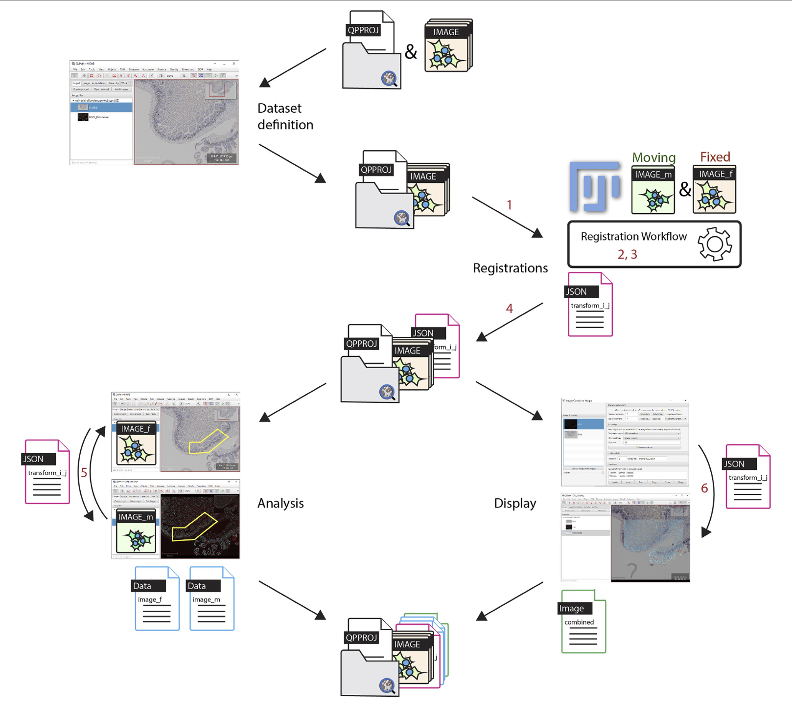
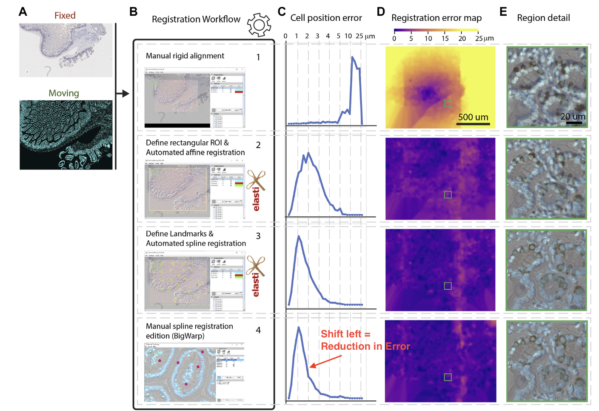

# An Open-Source Whole Slide Image Regristration Workflow at Cellular Precision Using FIJI, QuPath and Elastix

## Abstract
This paper suggests a *"user-friendly workflow which facilitates the nonlinear registration of whole slide images in order to reach sub-cellular resolution level."* It does this by
1. Get a set of whole slide images defined as a QuPath project
2. Open the project with FIJI, and perform the registrations.
    1. Each registration is automated using an `Elastix` backend, or semi-automated by `BigWarp`
3. These transformations are then retrieved in QuPath  
    1. Allows the transfer of any ROIs
    2. These transformations can be performed *"on the fly"* to display transformed images on top of the reference image.

## Introduction
WSI (Whole Slide Imaging) scans that incorporate at least two modalities are more and more common in pathology. These need to be registered which is a significant problem
* Images are often gigapixels in memory size
* Registration solutions are often more complex than simple affine transformations
* Most successful methods can't be performed by others, either because they are closed source, or there isn't sufficient documentation
    * Also will need to convert files to use workflows

** In short, the quality of the multi-modal registration algorithm is only one factor among many others influencing the adoption/popularity of an imaging analysis workflow**

The key factors identified are
* Open-source
* Easy to install
* Capable to read and display multi-resolution image files without conversion
* Capable to freely deform and interactively display deformed images
* Reasonably fast and accurate results
* Compatible with a modular and powerful analysis platform
These can be achieved with different bits of software
* [Bio-Formats](https://www.openmicroscopy.org/bio-formats/) to read in lots of different files
    * Over 100 different file formats, including .bif files
* [QuPath](https://qupath.github.io/) popular for WSI analysis, supports `Bio-Formats`, and is customiseable via scripting
* [Fiji](https://www.fiji.sc) which can arbitrarily deform, slice and display big images. There are two main plugins which will be useful
    * [ImgLib2](https://imagej.net/libs/imglib2/): ImgLib2 is a general-purpose, multidimensional image processing library.
    * [BigDataViewer](https://imagej.net/plugins/bdv/): The BigDataViewer is a re-slicing browser for terabyte-sized multi-view image sequences.
        * `BigWarp` is particularly useful for performing manual registration of multi-resolution datasets.
* [elastix library](https://github.com/SuperElastix/elastix): Now community supported by well-documented powerful image registration toolkit.

This paper presents a fast and easy to use workflow

## Results
The problem with the open-source tools listed above is that they all use different languages.
* Elastix is a C++ library with python wrappers, and no pre-compiled Java wrappers.
* Fiji and QuPath are both Java-based but use different versions of java. 

Somehow we need to find and allocate resources in order to make connections between components. In this paper they have created/implemented
1. A Fiji/BigDataViewer opener for QuPath projects
2. Support for Bio-Formats API for BigDataViewer.
3. Fiji plugins to bridge elastix and Fiji
4. A means to apply, store, and re-open the deformation function. --> This is really important, because it means I can register with the brightfield/plain image and then apply this to the version

### Workflow
This is called **Warpy** and there is [documentation](https://imagej.net/plugins/bdv/warpy/warpy) which also contains video tutorials as well, plus the [actual code](https://github.com/BIOP/qupath-extension-warpy). Fig 1 describes the workflow, but basically the steps are...

1. Manual rigid registration
2. Automated affine registration with elastix.
3. Semi-automated spline registration
4. Manual spline correction with the BigWarp plugin.
5. Ouput a transformation file that defines how coordinates can be converted from the moving image to the reference image

### Test Evaluation
Test data is fixed mouse duodenum, where sections are stained with EdU, then IHC is performed so the same cells are imaged, but with different cameras etc. Additionally there are some stitching artifacts.

Evaluation was based on manually selecting 3,000 landmarks and assessing the distance between the ground truth landmark and the recorded landmark. (Estimate is 6hrs worth of work for them).
- This is something that can be done at a later stage to see if the error margin is close enough for Yael. The number of points can be determined at a later stage, but the distances will be larger because it will probably be in 3D.
- In their estimates, the final step (step 4 above) of manual registration marginally improves the registration.

## Discussion and Perspectives
* The default parameters for Elastix seem to work for their dataset.
* Manual only is not enough
* This hasn't been tested in serial sections which means it might not work.
* We can use alternatives to Elastix as well in this pipeline. E.g. [PyImageJ](https://imagej.net/scripting/pyimagej)

## Conlcusion
* Clain is that this takes a few minutes per slide.
* [Tutorials](https://c4science.ch/w/warpy/) available too. (Link does not work - 2024/06/14). But [YouTube video playlist](https://www.youtube.com/watch?v=cgRA9NZ-AOo&list=PL2PJpdamvnti8PqyMdcezGLeAtH6LSy69) is available

